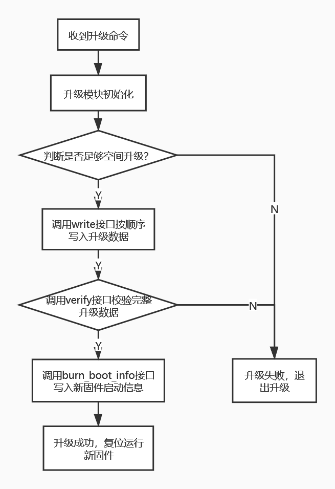
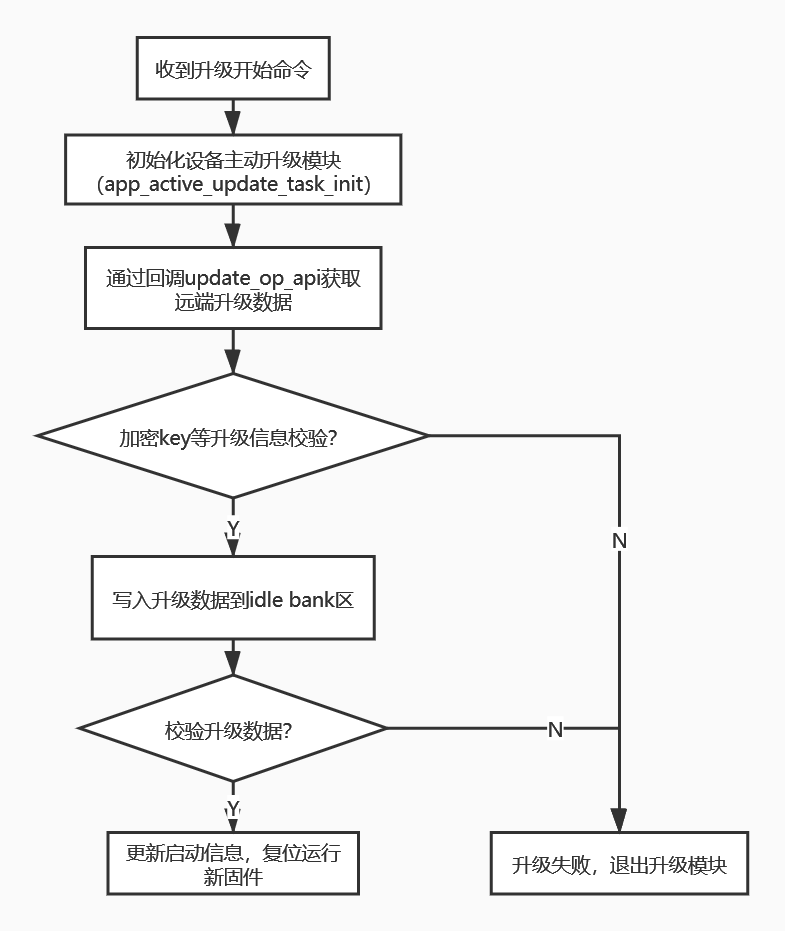

杰理升级结构——双备份升级使用介绍
1. 双备份存储结构介绍
  - 双备份存储结构有两个app code区域
  - 当运行app code 0时，升级时将新固件写入app code 1区域，反之亦然。
  - 升级时对app code N区域进行校验成功后，更新启动标志，复位后即可运行app code N代码
  - 当升级中断或者新写入固件校验不成功，不会影响原来app code 的运行
  
 ```
  ------------------
  - boot code      -
  ------------------
  - app code 0     -
  ------------------
  - app code 1     -
  ------------------
  - reserved area  -
  ------------------
 
 ```
 
2. 双备份升级流程
- 双备份设备被动升级流程图
<br/>
<div align="center">
  
</div>
<br/>

- 双备份设备主动升级流程图
<br/>
<div align="center">
  
</div>
<br/>


3. sdk相关配置

4. api接口说明
